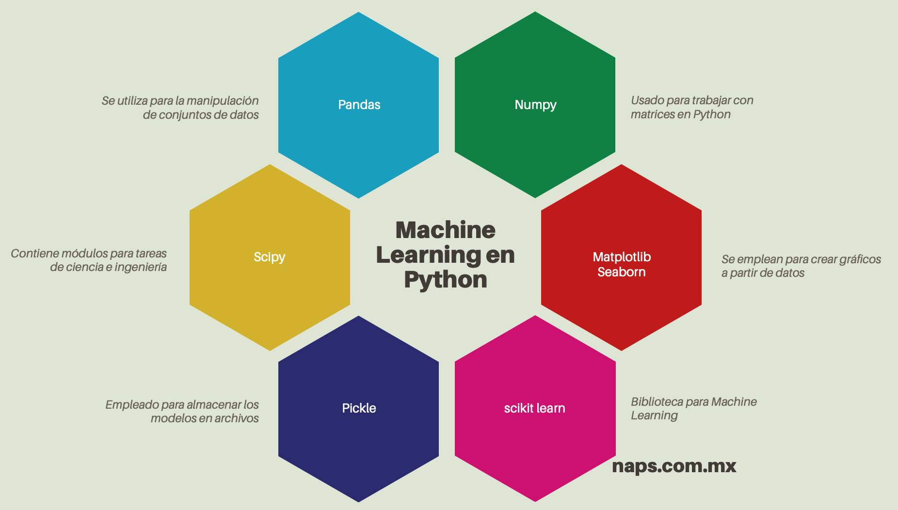

# ejemplos e informacion

 

 machine learning information:

    https://naps.com.mx/blog/introduccion-al-machine-learning-en-python/

 
 environments information:

    https://code.visualstudio.com/docs/python/environments

para crear el entorno: 

            python -m venv .venv

para habilitar el entorno: 
    
            nombre_de_env\Scripts\activate/eactivate

    

